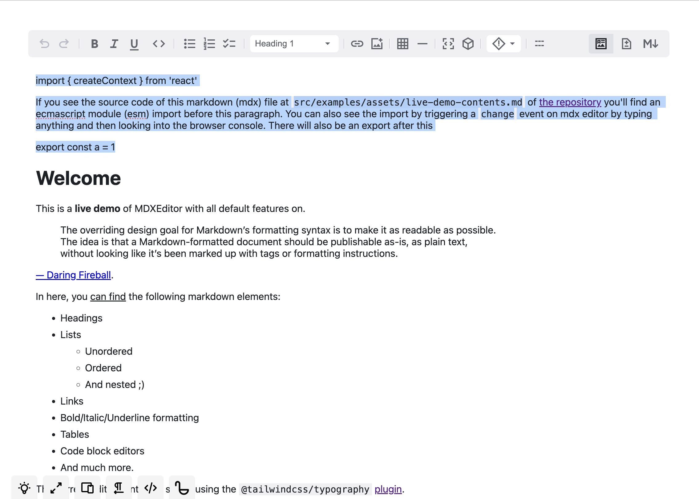
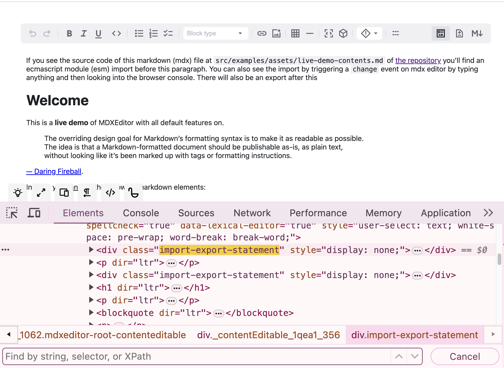

# MDXEditor ECMAScript Modules Handler Plugin

This is a plugin for [MDX Editor](https://github.com/mdx-editor/editor). It handles ESModules imports and export statements for use cases where you have to import and/or export inside of mdx files. For example if you are using MDX in astro (give link here), you might want to import components [like this](https://docs.astro.build/en/guides/markdown-content/#assigning-custom-components-to-html-elements).

In cases like these (with es modules used inside md/mdx files), if you are using mdxeditor, out of the box, it'll show you all es modules imports and exports statements as is in the lexical editor:



After using this plugin, the ES Modules will not be shown in the lexical editor (an empty hidden div is rendered)



But you'll have access to ES Modules it in the markdown that MDXEditor emits, so that you can correctly store it in your choice of persistence. You can check by running the demo with the plugin, by cloning this repo locally and running and running `pnpm{|npm} run dev` and make change in the editor like this:

https://github.com/arihantverma/mdx-editor-plugin-esm/assets/43805922/cfd86b42-a983-482a-9965-28ebb38415b4

## Usage

From [demo.tsx](./src/examples/demo.tsx)

```typescript
import { esmMdxEditorPlugin } from 'mdx-editor-plugin-esm'

return <MDXEditor markdown={markdown} onChange={(md) => console.log('change', { md })} plugins={[...ALL_PLUGINS, esmMdxEditorPlugin()]} />
```
